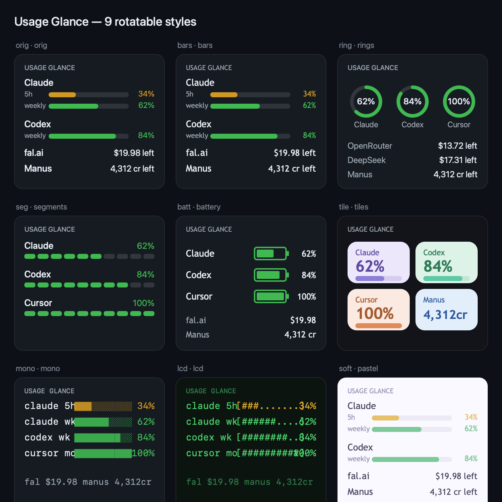

# Usage Glance

A tiny macOS desktop widget that shows, in one look, how much headroom you have left across every AI tool you pay for — **Claude**, **Codex**, **Cursor**, plus raw API balances — so you can route work to whatever still has gas in the tank instead of slamming into a limit mid-task.

Built on [Übersicht](https://github.com/felixhageloh/uebersicht). No server, no telemetry, no account. It talks **only** to each provider's own API with **your own** keys, straight from your desktop. ~600 readable lines.



---

## What it tracks

| Source | What you see | Where the number comes from |
|---|---|---|
| **Claude** (Max/Pro) | 5h + weekly remaining %, reset time | subscription rate-limit headers |
| **Codex** (ChatGPT) | 5h + weekly remaining %, reset time | local session snapshots |
| **Cursor** (Pro) | monthly included-usage %, reset | local app token + dashboard API |
| **OpenRouter** | credits left · used | `/credits` |
| **DeepSeek** | balance left | `/user/balance` |
| **fal.ai** | credit balance | `/account/billing` |
| **Manus** | credit balance, next reset | `/v2/usage.balance` |

Each subscription row also draws a **quota-vs-time pacing bar** — a second bar showing how much of the window's *time* is left. If the green (quota) bar is longer than the blue (time) bar, you're pacing safely; if time overtakes quota, you're burning faster than the clock. The three plans reset on different days, so this lets you compare them apples-to-apples.

## Nine looks, one click

A small `style` chip in the header rotates the whole widget through nine designs — `orig` (clean system font) → `bars` → `rings` → `segments` → `battery` → `tiles` → `mono` → `lcd` (retro pixel) → `soft` (light pastel). An `S/M/L/XL` chip rescales it, and you can **drag the header** anywhere. Style, size and position all persist locally, so it reopens exactly how you left it.

---

## How the data is pulled

This is the fun part. Every provider buries "how much do I have left" somewhere different — local files, undocumented endpoints, or response headers nobody reads. Here's the map.

### Claude — reading the meter when there is no meter

Claude's Max/Pro subscription has no public "remaining %" endpoint. The number you see in the app's usage screen is computed server-side and never handed to you cleanly. So Usage Glance reads it a different way:

**Every Anthropic API response carries the meter in its headers.** On each call, the server returns `anthropic-ratelimit-unified-5h-utilization` and `anthropic-ratelimit-unified-7d-utilization` — a `0..1` fraction of your subscription window consumed — plus reset timestamps. Those headers *are* the subscription gauge.

So the widget:

1. Mints a **long-lived, non-rotating token** with the official `claude setup-token` (the supported way to get a credential for headless use — it won't fight your live Claude Code session the way a shared OAuth refresh token would).
2. Fires a **single `max_tokens: 1` ping** to the cheapest Haiku model.
3. Reads the utilization headers off that response: `remaining = (1 − utilization) × 100`, reset from the `-reset` header.

That ping is the **only token-spending part of the entire widget**, so it's **activity-gated**: it only goes out when you've *actually used Claude Code since the last reading* (detected from the modification time of `~/.claude/projects/**/*.jsonl`) **and** at least 10 minutes have passed. The logic: your quota only moves when *you* use Claude — so when you're idle, the cached number is still correct and **zero** calls are made. During active coding it costs about one Haiku token every few minutes; when you walk away, it costs nothing.

> Why not the obvious `/api/oauth/usage` endpoint, which returns the exact numbers? Because a `setup-token` is scoped `user:inference` and that endpoint demands `user:profile` — it 403s. The header trick sidesteps the scope wall entirely and works with the token you can actually mint.

### Codex — local snapshots, zero auth

Codex writes a `rate_limits` snapshot into every session's rollout log (`~/.codex/sessions/**/rollout-*.jsonl`): a `primary` bucket (5-hour window) and `secondary` (weekly), each with `used_percent` and `resets_at`. The widget scans the newest session, grabs the last snapshot, and computes `remaining = 100 − used_percent`. Pure local file read — no network, no keys.

Three things that bite here, all handled:

- **The snapshot is only written on an actual model turn.** It's not a live gauge — it's the reading from your last Codex message. Leave Codex idle (app open but no turns) for hours and the number sits still because *nothing new is being logged*. That's expected, not a bug.
- **Rollout logs get huge** — a long-running session can pass Node's ~512 MB string limit, so slurping the file whole throws (and, if unguarded, takes the whole collector down). The reader **tail-reads** the last few MB of large files instead; `rate_limits` events recur throughout the log, so a recent one is still there.
- **A snapshot can outlive its window.** Once `resets_at` passes with no fresh turn to update it, that limit has already refilled. Rather than showing a stuck "resets now" at a stale percentage, the widget marks the window **100%** and rolls the reset clock forward to the next cycle; the next real turn corrects it exactly. (Claude's header-based reader does the equivalent when a subscription window elapses.)

### Cursor — borrowing the app's own session

Cursor's individual Pro plan has no public API. But the desktop app keeps a **fresh session token in its local SQLite** (`cursorAuth/accessToken` in `state.vscdb`). The widget reads it, decodes the user id from the JWT, and calls `cursor.com/api/usage-summary` (with an `Origin` header to clear CSRF) for `individualUsage.plan.totalPercentUsed` and the billing cycle. It's unofficial, but **self-maintaining** — Cursor keeps the token alive as you use the editor, so there's nothing to refresh by hand. The row is flagged with a `*` to mark it as an unofficial source.

### OpenRouter / DeepSeek / fal.ai — clean balance endpoints

The easy ones. Each exposes a documented balance/credits endpoint hit with your own key: OpenRouter `GET /api/v1/credits` (`total_credits − total_usage`), DeepSeek `GET /user/balance`, fal.ai `GET /v1/account/billing?expand=credits` (needs an **admin**-scoped key — an inference key 403s on billing). Balances change slowly, so these are cached ~10 minutes.

### Manus — the balance endpoint hiding behind a ledger

Manus's public API documents `GET /v2/usage.list` — a paginated, signed **transaction ledger** (grants `+`, task costs `−`, refunds `+`). The tempting move is to sum it for a balance. **Don't.** Monthly subscription credits *expire* with no offsetting `−` entry, so the sum overcounts (it read ~7,500 when the account truly had ~4,300).

The real source is a **Connect/gRPC RPC**, not REST. Manus briefly shipped a REST alias (`GET /v2/usage.balance`) and then **retired it** (it now 404s). Reaching for that dead path is a trap. The stable endpoint — the one the native app *and* your API key actually authenticate against — is found by `strings`-ing the Manus app binary, which reveals the service catalog:

```
POST https://api.manus.ai/openapi.v2.OpenapiV2Service/GetAvailableCredits
     header: x-manus-api-key: <key>        body: {}   (Connect unary call)
 -> { "total_credits": 282, "pro_monthly_credits": 4000, "refresh_credits": 300, ... }
```

`total_credits` is the live balance — exact match to the in-app figure, one call, no pagination. Cached ~10 minutes like the other balances.

One more wrinkle on the **renewal countdown**: the API exposes `next_refresh_time` (the *daily* free-credit top-up) and the plan's *annual* renewal, but **not** the monthly Pro refresh — that lands on a roughly fixed day (the Pro grants came Apr 10, May 10, Jun 12). So the countdown shown under the row is computed locally from a configurable `manusRenewalDay` (default 10), independent of the balance call.

> **Resilience note.** Because Manus has already moved this endpoint once, the collector treats *any* spend balance defensively: a brief outage shows the last value dimmed and marked `stale`, and once it's too old to trust the row degrades to `—` rather than displaying a confidently-wrong number. It self-heals the moment the endpoint answers again.

---

## Known gaps — got a better idea?

One tool I *wanted* in here but couldn't pull **reliably**. If you know a clean, non-fragile way to read it, please [open an issue or PR](../../issues) — I'd merge it happily.

### Gemini (consumer "Gemini" subscription)
- **Want:** the "Usage limits" progress ("4% used, resets 3:27 PM"), like Claude/Codex.
- **Tried:** no public API, no CLI token. That screen is drawn by Google's logged-in web app via an internal `batchexecute` RPC keyed on session cookies.
- **Why skipped:** the only path is scraping Google's consumer web auth — cookies rotate, it can trip account-security, and it breaks constantly.
- **Better idea?** If Google ships a usage endpoint or a CLI token (à la `claude setup-token`), it's a 20-minute add.

> **Update — Manus solved.** Manus *was* in this list (the documented API exposes only a per-task ledger, no balance). It now ships: probing the v2 namespace surfaced an undocumented `GET /v2/usage.balance` that returns `total_credits` directly. See **[How the data is pulled → Manus](#manus--the-balance-endpoint-hiding-behind-a-ledger)**. Proof that the "better idea?" invitation works.

Same invitation for everything else: spot a cleaner way to read any source, or want a provider added? Issues and PRs welcome.

---

## Architecture

Two pieces, deliberately decoupled:

- **`collect.mjs`** — a dependency-free Node script. Gathers every source, normalizes to one JSON blob, prints to stdout. Every source is isolated: one failure degrades that row to `—` and never breaks the others. Run it standalone to debug: `node collect.mjs`.
- **`index.jsx`** — the Übersicht widget. Runs `collect.mjs` on a 60s interval and renders the JSON in whichever of the nine styles you've selected (all nine are rendered and toggled client-side, so switching is instant).

## Security

- **No secrets in this repo.** Keys never live in the widget code — they're read at runtime from the macOS **Keychain** (preferred) or `~/.config/usage-glance/config.json` (chmod 600).
- `harden.sh` migrates any plaintext keys from config into the Keychain (encrypted at rest), then blanks the plaintext copies.
- The widget makes outbound HTTPS only to the providers above, with your own credentials. **No telemetry, no servers, no third parties.**

## Setup

1. **Install Übersicht:** `brew install --cask ubersicht`
2. **Install the widget:** copy this folder to `~/Library/Application Support/Übersicht/widgets/usage-glance/`, then enable it from the Übersicht menu.
3. **Node path:** the widget runs `node collect.mjs`. If Übersicht can't find `node` on its PATH, set `NODE` in `index.jsx` to an absolute path (`which node`).
4. **Add the keys you have** (any subset — missing ones just show `—`). Copy `config.example.json` to `~/.config/usage-glance/config.json` and fill in, or use the clipboard helpers:
   - `bash set-key.sh OPENROUTER_API_KEY` → reads the key from your clipboard into the Keychain
   - `bash set-key-config.sh DEEPSEEK_API_KEY` → into config.json instead (no Keychain prompt)
   - **Claude:** `claude setup-token` → copy the `sk-ant-oat01-…` token → `bash set-key.sh CLAUDE_CODE_OAUTH_TOKEN`
   - **fal.ai:** create an **admin**-scoped key at fal.ai/dashboard/keys → `bash set-key.sh FAL_KEY`
   - **Manus:** create a key at manus.im → Settings → API Keys → `bash set-key.sh MANUS_API_KEY`
   - **Codex / Cursor:** nothing to add — read from local files / the app's own token.

## Config reference

`~/.config/usage-glance/config.json` (see `config.example.json`):

- `size` — default scale: `small` · `medium` · `large` · `extra large`
- `sources` — toggle rows on/off by key (`claude`, `codex`, `cursor`, `openrouter`, `deepseek`, `fal`, `manus`)
- `spendTtlMinutes` / `claudeMinProbeMinutes` — cache windows
- `secrets` — API keys (or store them in the Keychain instead)
- `envFile` — optional path to an existing dotenv to source keys from

## License

MIT — see [LICENSE](LICENSE).
